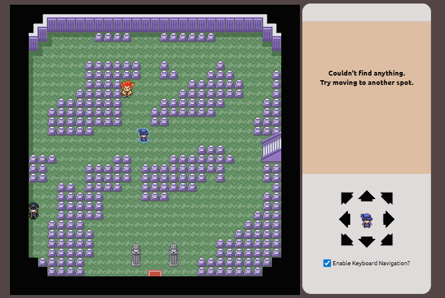
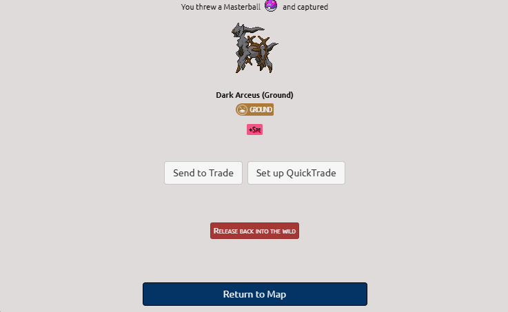
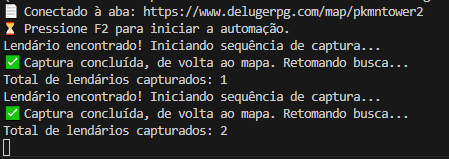
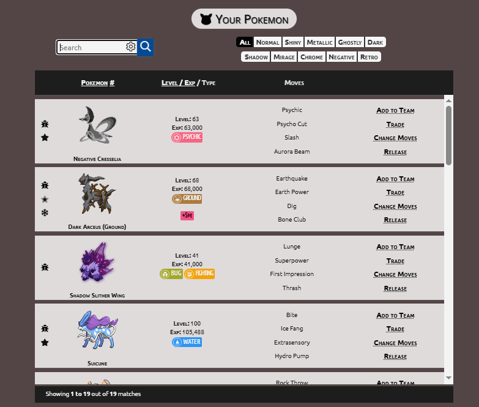

### Automação de Navegador com Playwright – Estudo de Caso no Pokémon Deluge

Este repositório contém um **projeto de estudo** utilizando [Playwright](https://playwright.dev/) e Python para automatizar interações com o jogo de navegador **Pokémon Deluge**.

O objetivo principal **não é ganhar vantagem competitiva no jogo**, mas sim:

- praticar automação de navegador;
- estudar seleção de elementos no DOM (CSS selectors, IDs, classes etc.);
- lidar com páginas dinâmicas (textos que aparecem/desaparecem, botões condicionais);
- aprender a conectar o Playwright a um navegador já aberto via **CDP (Chrome DevTools Protocol)**;
- exercitar tratamento de erros, reconexão e controle por teclado (F2).

> ⚠️ **Aviso Importante – Projeto Estritamente Educacional**
>
> - Este código foi desenvolvido apenas para fins **didáticos e pessoais**, como estudo de automação web.
> - Não há intenção de prejudicar o jogo, outros jogadores ou a equipe de desenvolvimento do Pokémon Deluge.
> - Se você pretende adaptar este projeto, **leia e respeite os Termos de Uso** do jogo e da plataforma.
> - O autor **não incentiva** o uso de automação em ambientes que proíbem esse tipo de prática.

---

### 🔍 Visão Geral do Projeto

A automação faz, em alto nível, o seguinte:

1. Conecta-se a uma instância do navegador (Edge/Chrome) aberta manualmente em modo de depuração (CDP).
2. Localiza a aba em que o jogador já está logado no **Pokémon Deluge** e posicionado no mapa.
3. Ao pressionar uma tecla de atalho (ex.: **F2**), inicia o loop de automação:
   - movimenta o personagem no mapa (teclas `A` e `D`);
   - após cada movimento, verifica se apareceu um Pokémon;
   - se o texto indicar um Pokémon **lendário/raro**, executa a sequência de captura:
     - clicar em **“Try to Catch It”**;
     - clicar em **“Start Battle”**;
     - selecionar **Master Ball**;
     - clicar em **“Throw Master Ball”**;
     - ao final, clicar em **“Return to Map”**;
   - retorna ao mapa e continua procurando automaticamente.

Todo o fluxo é controlado via código em Python com Playwright, tratando mudanças de página, ausência de elementos e eventuais erros de conexão com o navegador.

---

### 🧠 Conceitos Técnicos Trabalhados

Alguns dos temas que este projeto aborda:

- **Playwright (Python)**  
  - navegação em páginas web;
  - uso de `locator`, `wait_for_selector`, `inner_text`, `click`, etc.;
  - controle de teclado (`page.keyboard.press`).

- **Integração com navegador já aberto (CDP)**  
  - uso de `p.chromium.connect_over_cdp("http://localhost:9222")`;
  - reaproveitamento de sessão já autenticada (cookies, login, Cloudflare resolvido).

- **Tratamento de Erros e Robustez**  
  - detecção de `TargetClosedError` (quando a aba ou o alvo do Playwright é fechado/recarregado);
  - tentativas de reconexão automática ao navegador e à aba do jogo;
  - uso de timeouts curtos para evitar travamentos (`wait_for_selector`, `wait_for_timeout`).

- **Automação Guiada por Teclado**  
  - uso da biblioteca `keyboard` para iniciar a automação somente após o usuário pressionar uma tecla de função (ex.: F2);
  - possibilidade de pausar/interromper o script facilmente.

---

### 🖼 Demonstrações (Screenshots)

- Personagem no mapa com o navegador em modo debug:

  

- Pokemón raro capturado sem ação humana:

  

- Log do Script:

  

- Resultado:

  
